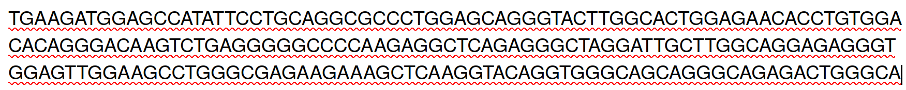

# Training on large language models for genomics

## Overview

In this repository, we will follow a training for large language models (LLMs) for genomics. The training comprises a short lecture and several lab classes. 

## Lecture notes

You can download the lecture note [here](CM_llm_genomics.pdf).

[Video of the lecture](https://youtu.be/vv_adlFXGc8)

## Lab classes

### Data to pretrain the model

The data can be found in the file: 
- data/genome_sequences/hg38/sequences_hg38_200b_verysmall.csv.gz 

The file contains 100,000 non-overlapping DNA sequences of 200 bases, corresponding to around 1% of the human genome. For instance, here is one DNA sequence of 200 bases:

### Pretraining of an LLM on DNA sequences

We will pretrain an LLM from scratch (a simplified mistral model, see folder data/models/Mixtral-8x7B-v0.1/) on the 100,000 DNA sequences from the human genome. 
The LLM is pretrained with causal language modeling using 200b DNA sequences from the human genome hg38 assembly.

[Script on Google Colab](https://colab.research.google.com/drive/1gcw_MYiqwB-pbVYHIx8kevx-ZD7sqMxL#scrollTo=JTYKjBrwRSU6)

[Commented script](https://github.com/galaxyproject/training-material/blob/main/topics/statistics/tutorials/genomic-llm-pretraining/tutorial.md)

[Video of the tutorial](https://www.youtube.com/watch?v=jY9ieFUM3cw)

[Medium article](https://medium.com/@morphos77/mistral-dna-mistral-model-for-genomics-e800e8349ed4)

### Finetuning of an LLM for DNA sequence classification

We will use a pretrained LLM from huggingface (https://huggingface.co/RaphaelMourad/Mistral-DNA-v1-17M-hg38) and finetune it for DNA sequence classification. 
The aim is to classify a DNA sequence depending on whether it binds a protein or not (transcription factor), or if a histone mark is present, or if a promoter is active.

[Script on Google Colab](https://colab.research.google.com/drive/19AQsrmiCnEfvgHKz7HQ27-vFsHQogrya)

[Commented script](https://github.com/galaxyproject/training-material/blob/main/topics/statistics/tutorials/genomic-llm-finetuning/tutorial.md)

[Video of the tutorial](https://youtu.be/Ohwi8pHlemc?si=lVjwIeKJMJkPZt1l)

[Medium article](https://medium.com/@morphos77/mistral-dna-mistral-model-for-genomics-e800e8349ed4)

### Zeroshot learning prediction of mutation effect

We will use a pretrained LLM from huggingface (https://huggingface.co/RaphaelMourad/Mistral-DNA-v1-17M-hg38) to predict the impact of mutations with zeroshot learning (directly using the pretrained model for DNA sequences).
Here, we compute the embedding of the wild type sequence and compare it to the embedding of the mutated sequence, and then compute a L2 distance between the two embeddings.
We expect that the higher the distance, the larger the mutation effect.

[Script on Google Colab](https://colab.research.google.com/drive/1cn_0BBi13Fq2hIFAI9_t9IGmp5O-D2vs#scrollTo=Q_UgR6UsOgPn)

[Commented script](https://github.com/galaxyproject/training-material/blob/main/topics/statistics/tutorials/genomic-llm-zeroshot-prediction/tutorial.md)

[Video of the tutorial](https://youtu.be/jAAVGINhMBo)

[Medium article](https://medium.com/@raphaeldaroum/how-to-predict-the-impact-of-dna-mutations-with-ai-and-zero-shot-learning-2d0022938e70)

### Synthetic DNA sequence generation

We will use a pretrained LLM from huggingface (https://huggingface.co/RaphaelMourad/Mistral-DNA-v1-138M-yeast) to generate artificial yeast DNA sequences.

[Script on Google Colab](https://colab.research.google.com/drive/1ej879r_AWGjVju74eTUYhCctj-c8IPob#scrollTo=9yi5HmkTxgY5).

[Commented script](https://github.com/galaxyproject/training-material/blob/main/topics/statistics/tutorials/genomic-llm-sequence-generation/tutorial.md)

[Video of the tutorial](https://youtu.be/F4v5KdFHrXw)

[Medium article](https://medium.com/@raphaeldaroum/how-to-generate-artificial-dna-sequences-with-an-llm-5da6da031d57)

### DNA sequence optimization

We will use a finetuned LLM for promoter or transcription factor binding. 

[Script on Google Colab](https://colab.research.google.com/drive/1wNLRBwROuZoSiQ6NjcT4VzLIQftP7ERP#scrollTo=rKEzACkjcj7N).

[Video of the tutorial](https://youtu.be/7l20tG8vKm8)

